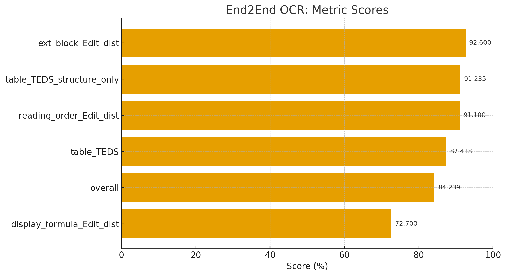
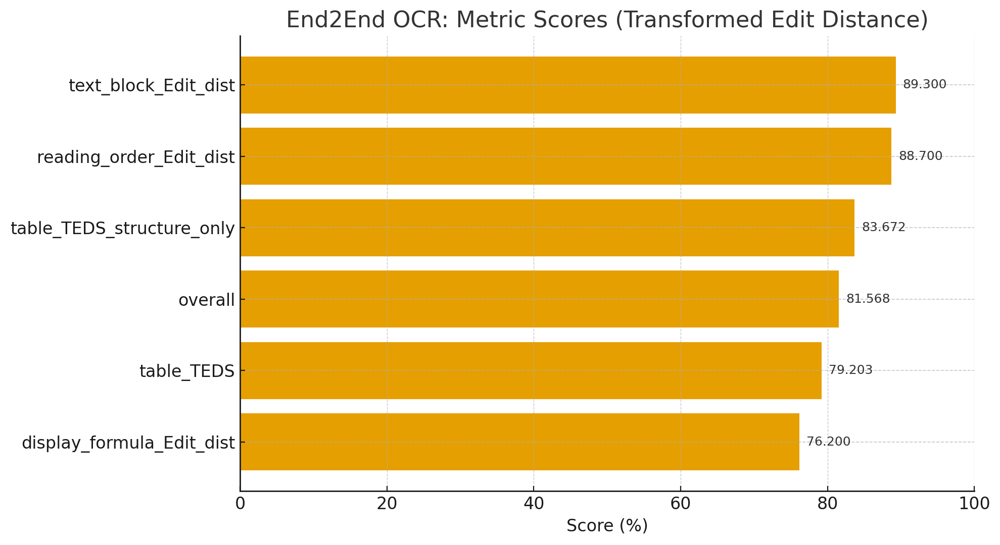
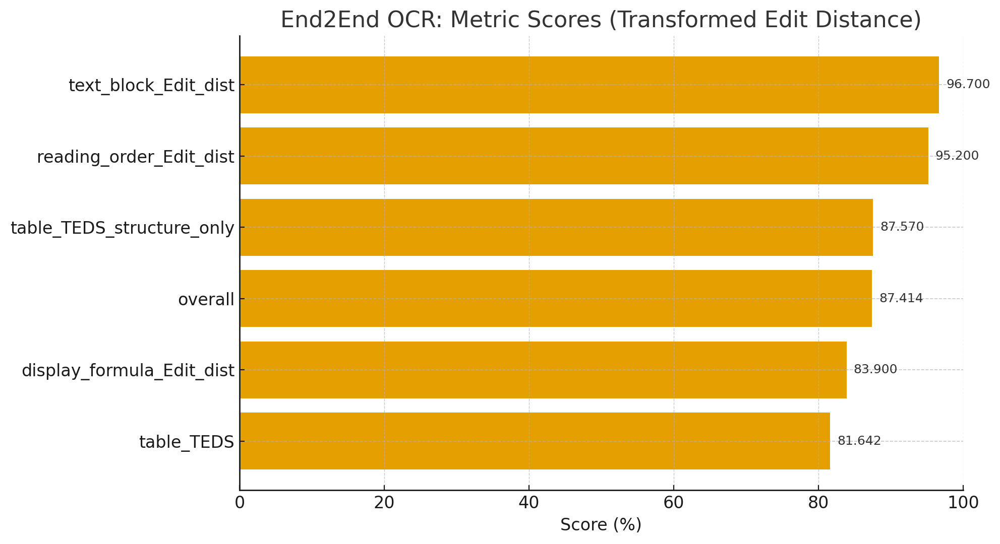
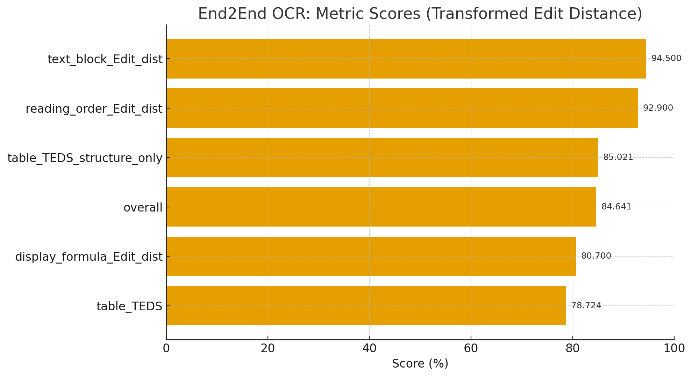
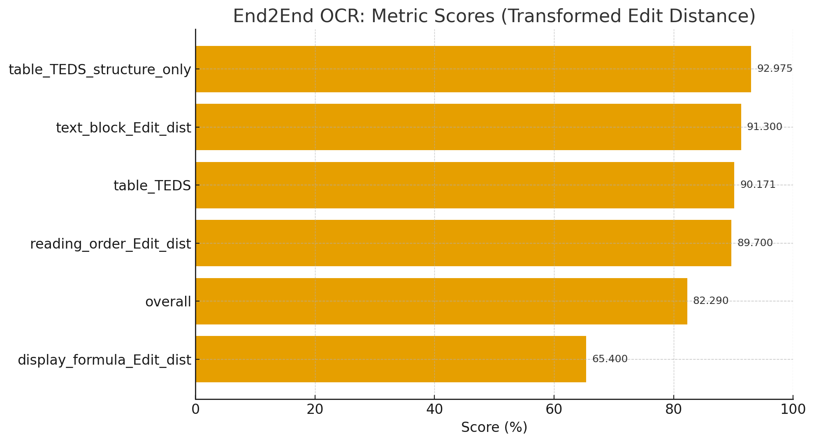
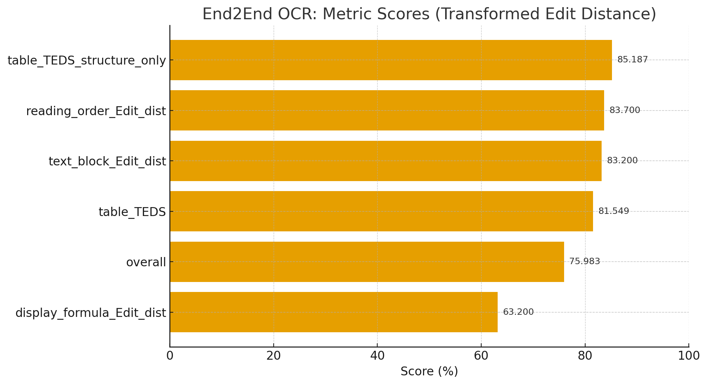

# Evaluation Summary 

## DeepSeek-OCR vs. OLmOCR2 on OmniDocBench!

Date: 2025-10-29

This report summarizes evaluation results for DeepSeek OCR (vLLM pipeline) and OLmOCR2on an OmniDocBench end-to-end run of 1,355 rich annotated pdf images. The core metrics below are taken from the evaluation output (`results_dpsk-cleaned_quick_match_metric_result.json`). I compute 95% confidence intervals (CI) for each key metric using the normal (Wald) approximation with z ≈ 1.95 (as requested). Where a metric is reported as a normalized edit distance (Edit_dist), I convert it to an accuracy-style quantity (1 − Edit_dist) to produce an intuitive CI on the success rate.

Summary of reported aggregate metrics (from evaluation)

In plain terms:
- Text paragraph normalized edit distance
- Display-formula edit distance
- Table similarity (TEDS)
- Table structure-only TEDS
- Reading-order edit distance
- Overall score reported

## Figures

### Overall comparison

*Figure — Overall evaluation plots for DeepSeek (left) and OLmOCR-2 (right).

### Language breakdown — English

*Per-language performance (English) for both systems.*

### Language breakdown — Chinese

*Per-language performance (Chinese) for both systems.*

*Example document crops / OCR outputs from the dataset.*

Methodology for the confidence intervals
- Sample size: n = 1,355 pages
- CI method: Wald (normal approximation) using z = 1.95 (user requested approximation). For a proportion p, standard error is SE = sqrt(p*(1-p)/n), margin of error ME = z * SE, and CI = p ± ME.
- For Edit_dist entries we report the CI on (1 − Edit_dist) so readers see an accuracy interval rather than an error-rate interval. (This aligns interpretatively with TEDS and overall which are percent-style.)

## Definitions

- Normalized edit distance: A length-normalized measure of how different a predicted string is from the ground truth (0 = identical, 1 = completely different).
- Accuracy (1 − Edit_dist): The complement of normalized edit distance; the proportion correct shown as a percentage (e.g., 0.926 → 92.6%).
- TEDS: Table Edit Distance-based Similarity — a table-quality score derived from tree-edit-distance between predicted and ground-truth table structures and content (reported 0–100%, higher is better).
- Table TEDS (structure-only): The TEDS score computed using only the table’s structural/layout information (cell positions and nesting), ignoring cell text.
- Reading-order edit distance: Normalized edit distance computed on the predicted vs. reference reading-order sequence; lower is better (often reported as accuracy = 1 − value).
- Overall score: The aggregate document-level score from the evaluation run (a summary metric reported by OmniDocBench combining components).

Results — point estimates with 95% CI (z = 1.95)

| Metric | Point estimate (pct) | 95% CI (pct) |
|---|---:|---:|
| Text-block accuracy (1 − text_block_Edit_dist) | 92.600% | [91.214%, 93.986%] |
| Display-formula accuracy (1 − display_formula_Edit_dist) | 72.700% | [70.339%, 75.061%] |
| Table TEDS (full) | 87.418% | [85.659%, 89.177%] |
| Table TEDS (structure only) | 91.235% | [89.736%, 92.734%] |
| Reading-order accuracy (1 − reading_order_Edit_dist) | 91.100% | [89.591%, 92.609%] |
| Overall (reported) | 84.239% | [82.309%, 86.170%] |

Notes on calculation (quick reference)
- Example (text-block accuracy): p = 1 − 0.074 = 0.926. SE = sqrt(0.926 × 0.074 / 1355) ≈ 0.00711. ME = 1.95 × SE ≈ 0.01386. CI = 0.926 ± 0.01386 → [0.91214, 0.93986] → [91.214%, 93.986%].
- For TEDS values I treat the reported percent as a proportion (0–1) and apply the same Wald formula.

Interpretation and takeaways
- Text paragraphs: High accuracy (≈92.6%) with a tight CI (±≈1.39 percentage points). DeepSeek recovers text blocks reliably on this set.
- Display formulas: Lower accuracy (≈72.7%) with a wider CI (±≈2.36 points). Formula parsing remains the weakest component and is the main contributor to reduced overall score.
- Tables: Strong structural recovery (TEDS_structure_only ≈91.2%) and good full-table similarity (≈87.4%), both with narrow CIs (±≈1.5–1.8 points). This indicates the pipeline recovers table layouts well and also extracts content with good fidelity.
- Reading order: Very good (≈91.1%, ±≈1.51 points), meaning predicted reading sequences match ground-truth order well.
- Overall: Reported overall ≈84.24% with 95% CI ≈ [82.31%, 86.17%]. This reflects the combined effect of very good table+order recovery, strong text recovery, and weaker formula recovery.
